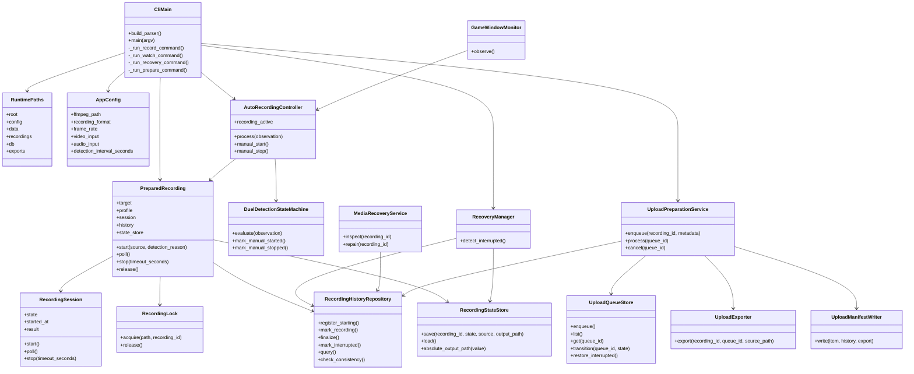
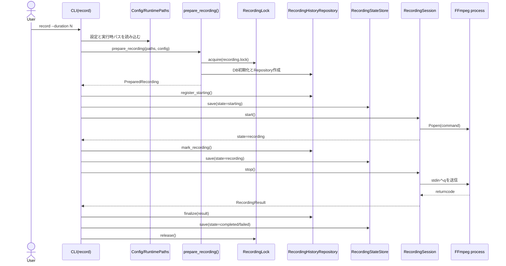
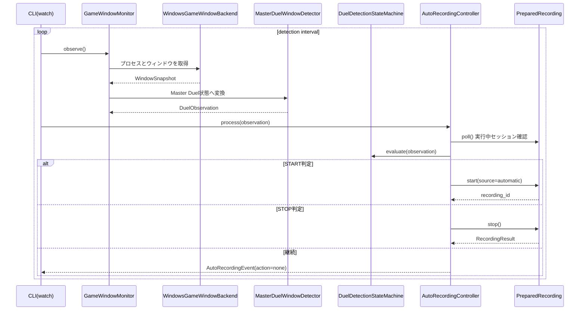
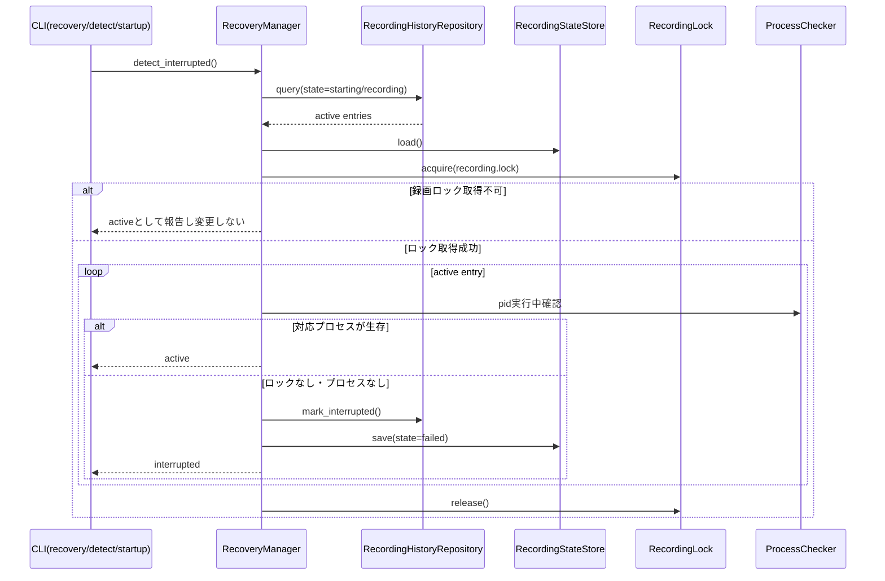
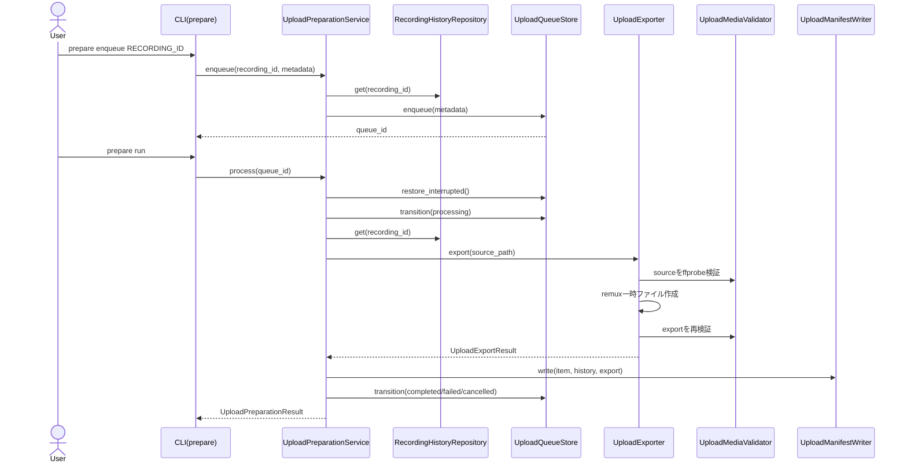

# 内部デザインノート

## 目的

このノートは、`master-duel-recorder-lite` V0.8.0 の内部構造を開発者が短時間で把握できるようにまとめる資料です。個別の設計判断は既存の `docs/architecture/*.md` に残し、この文書では CLI、録画、検出、履歴、復旧、アップロード準備のつながりを横断的に説明します。

本プロジェクトの中核方針は、OBS Plugin や OBS WebSocket に依存せず、Python 側で録画制御、状態管理、履歴、復旧、アップロード準備を分離して扱うことです。FFmpeg は動画作成と検証を担当する外部プロセスとして扱い、Python はその入力、出力、状態遷移、失敗時の整合性を管理します。

## 全体構成

| 領域 | 主な責務 | 代表モジュール |
|---|---|---|
| CLI | ユーザー操作、終了コード、JSON出力、サブコマンド分岐 | `__main__.py` |
| Config / Runtime | 設定読み書き、実行時ディレクトリ、保存先分離 | `config.py`, `runtime_paths.py` |
| Recording | FFmpeg録画コマンド、録画ロック、プロセス状態、履歴更新 | `recorder.py`, `recording_session.py` |
| Detection | Master Duelウィンドウ観測、開始・停止判定 | `game_window.py`, `detection.py`, `auto_recording.py` |
| History | SQLite履歴、録画状態、整合性チェック、復旧状態 | `recording_history.py`, `history_database.py` |
| Recovery | 中断録画検出、元ファイル保護、検査・修復 | `recovery.py`, `media_recovery.py` |
| Upload Preparation | 準備キュー、メディア検証、remux、マニフェスト出力 | `upload_preparation.py`, `upload_queue.py` |

実行時データは `user_data/` 配下に隔離します。録画ファイル、SQLite DB、キュー、状態ファイル、ログはアプリ本体と分離し、更新や再配置でユーザーデータを壊しにくくします。

## 主要クラス図

この図では、CLIを入口、`RuntimePaths` と `AppConfig` を実行条件、各サービスをユースケースの中核として整理しています。`PreparedRecording` は録画の横断制御を担い、`RecordingSession` は FFmpeg プロセスの開始、停止、診断出力、終了状態だけに集中します。この分離により、履歴や状態ファイルの保存失敗を録画プロセス制御と混ぜずに扱えます。

## 録画開始・停止シーケンス

録画開始時は、先に履歴へ `starting` を登録し、その後にプロセス状態ファイルを保存します。FFmpeg が開始直後に終了した場合でも `RecordingSession` は `RecordingResult` を作り、`PreparedRecording` が履歴を最終状態へ確定します。これにより、開始に成功したか不明な録画を履歴外に残しにくくしています。

## 自動録画シーケンス

現在の検出は可視ウィンドウの存在判定です。`DuelDetectionStateMachine` は連続観測回数と手動開始・停止の状態を見て、開始、停止、継続を決めます。将来テンプレートマッチングやOCRを追加する場合も、`DuelObservation` を拡張する形にすると自動録画制御への影響を抑えられます。

## 復旧検出シーケンス

復旧検出は、録画ロック、状態ファイル、履歴の3点を照合します。別プロセスが録画中の可能性がある場合は変更しません。中断と判定した場合だけ履歴を `failed` に更新し、復旧対象として後続の `inspect` や `repair` に渡せる状態にします。

## アップロード準備シーケンス

アップロード準備は外部サービスへの直接アップロードではありません。正常完了した録画を検証し、共有に使える MP4、メタデータ、SHA-256、マニフェストを `user_data/data/exports/` に作る段階までを責務とします。元録画は削除せず、失敗時も部分成果物を勝手に消さない方針です。

## 設計上の注意点

### 状態の二重管理

録画状態は SQLite 履歴と `recording-state.json` の両方に残します。SQLite はユーザーに見せる履歴と復旧状態の正本、状態ファイルはプロセスIDと直近録画を素早く照合するための補助です。両方を持つことで復旧性は上がりますが、更新順序を誤ると矛盾が生じます。そのため、録画制御は `PreparedRecording` に集約し、直接 `RecordingSession` だけを操作する呼び出しを増やさない方が安全です。

### ロックと実行時データ

`RecordingLock` は同時録画を防ぐための境界です。`record` と `watch` は同じロックを使うため、別コマンドからの同時開始を拒否できます。`user_data/` は実行時データであり、テストや移行以外で削除、初期化、上書きする処理を追加してはいけません。

### 失敗を正常完了にしない

FFmpeg の起動失敗、空ファイル、終了コード異常、履歴更新失敗、状態ファイル保存失敗は正常完了として扱いません。ユーザーに見える終了コード、履歴の `failed`、復旧状態のいずれかに落とし、原因を追える診断情報を残します。

### 今後の拡張余地

検出精度を上げる場合は、`GameWindowMonitor` と `DuelObservation` の情報量を増やし、`AutoRecordingController` の録画開始・停止契約は維持します。GUIや直接アップロードを追加する場合も、既存CLIの中核サービスを再利用し、UI層からDB、FFmpeg、キューを直接操作しない構成を保つべきです。

## 関連資料

- [OBS 非依存アーキテクチャ概要](overview.md)
- [録画環境の初期化設計](recording-environment.md)
- [最小録画設計](recording.md)
- [Master Duel向け録画補助設計](detection.md)
- [録画履歴設計](history.md)
- [失敗時の復旧設計](recovery.md)
- [アップロード準備設計](upload-preparation.md)
- [設定・運用CLI設計](cli.md)
